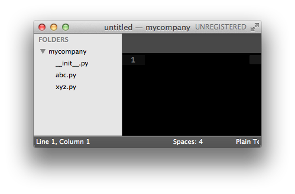
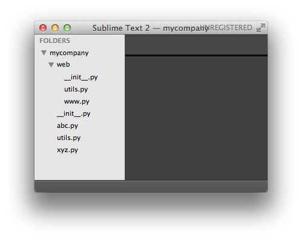

##一个.py文件就称之为一个模块（Module）


一个<font color= CornflowerBlue size=4>abc.py</font>的文件就是一个名字叫<font color= CornflowerBlue size=4>abc</font>的模块



```python
abc.py模块的名字就变成了mycompany.abc
每一个包目录下面都会有一个__init__.py的文件，
这个文件是必须存在的，否则，Python就把这个目录当成普通目录，
而不是一个包。__init__.py可以是空文件，也可以有Python代码，
因为__init__.py本身就是一个模块，而它的模块名就是mycompany。
```



```python
文件www.py的模块名就是mycompany.web.www，
两个文件utils.py的模块名分别是mycompany.utils和mycompany.web.utils。

自己创建模块时要注意命名，不能和Python自带的模块名称冲突。
```
